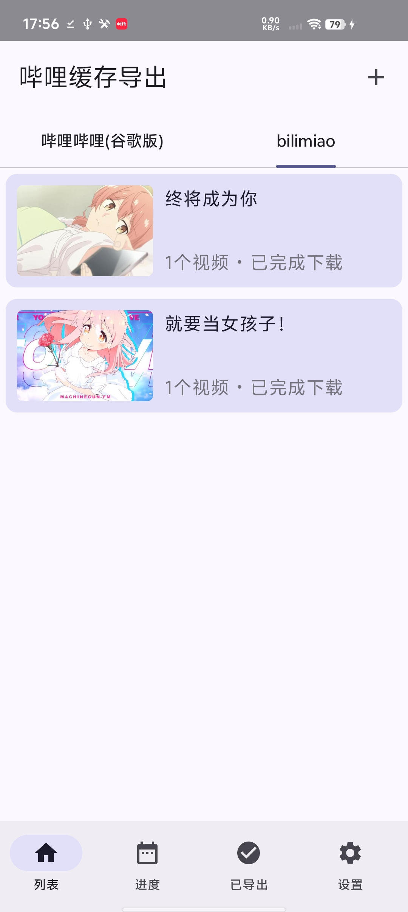
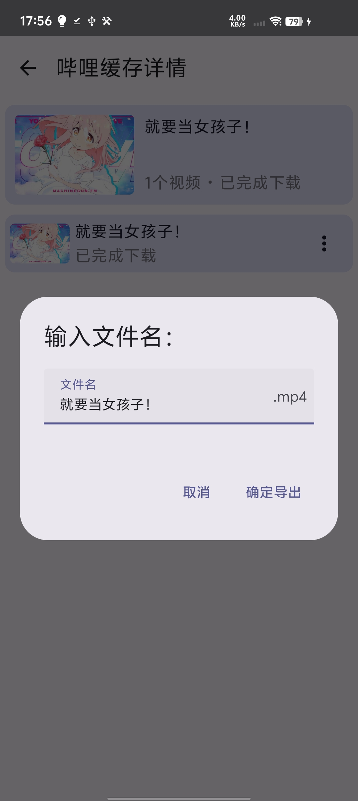

# BiliDownOut（哔哩缓存导出）
  

> 一个把哔哩哔哩 APP 离线缓存视频干净导出的工具。
> 本项目是 [10miaomiao/bili-down-out](https://github.com/10miaomiao/bili-down-out)（哔哩缓存导出）的**增强分支（fork）**，在原版基础上补充了「按 UP 主分组浏览」「多维排序」「导出记录多选」等功能。当前版本 **v1.6.1**。

---

### 关于本项目

哔哩哔哩离线缓存的视频被保存在 `Android/data` 深处，普通文件管理器无法直接导出，导出来也是一堆 `entry.json` / `blv/*.blv` 看不懂的文件。BiliDownOut 就是用来解决这个问题的：**读取哔哩哔哩 APP 缓存的视频，拼接后导出成正常可看的文件夹**。

> 高版本安卓（Android 13+）访问 `Android/data` 需要先安装并授权 [Shizuku](https://shizuku.rikka.app/)。

### 功能一览

- 导出哔哩哔哩 APP 离线缓存视频（含拼接、重命名）
- **按 UP 主分组浏览**：每个分组带 UP 主头像，自动按中文拼音排序
- **番剧 / 影视独立分组**：不再混入 UP 主内容
- **多维排序**：按 UP 主拼音 / 名称 / 大小（可快速找出占用空间最大的内容）
- 导出记录页**多选、批量处理**
- **列表缓存持久化**，进程被杀后重新打开不再一直转圈

### 使用说明（快速上手）

1. **系统要求**：`minSdk 21`（Android 5.0）+；Android 13+ 需要 Shizuku。
2. **安装**：从下方「下载」链接取 APK 安装。
3. **首次授权**：
   - Android 13+：安装并打开 [Shizuku](https://shizuku.rikka.app/)，启动服务后，在本 App 中授权；若列表页出现 Shizuku 错误提示，可点击「前往开启」跳到 Shizuku。
   - Android 12 及以下：在系统设置中授予「存储权限」（管理所有文件）即可。
4. **使用**：打开 App 让其扫描缓存 → 在列表中选择要导出的缓存 → 点导出，选好目标文件夹，完成后即可在目标目录看到整理好的视频。

### 界面截图

界面截图可参考应用商店素材（应用内体验优先，更多截图后续补充）：

| 截图示例 | 截图示例 | 截图示例 |
| :---: | :---: | :---: |
|  |  |  |

### 下载

- **GitHub Releases**：https://github.com/WhyWhatHow/bili-down-out/releases （打 `v*` 标签会自动触发 CI：跑单测 → 打 debug 包 → 发布到 Release）

### 与上游的关系

本项目 fork 自 [10miaomiao/bili-down-out](https://github.com/10miaomiao/bili-down-out) ，由衷感谢原作者的开源贡献。右上角仓库页的 **Star** 是对作者最大的支持；若你认可本分支的增强，也欢迎在 [Issues](https://github.com/WhyWhatHow/bili-down-out/issues) 里反馈意见。

### 声明

此项目（BiliDownOut）是个人为了兴趣而开发，仅用于学习和测试。

### 致谢 / License

- 上游项目：[10miaomiao/bili-down-out](https://github.com/10miaomiao/bili-down-out)（Apache-2.0，见本仓库 [LICENSE](LICENSE)）
- 本项目在保留上游版权声明的前提下进行增强。