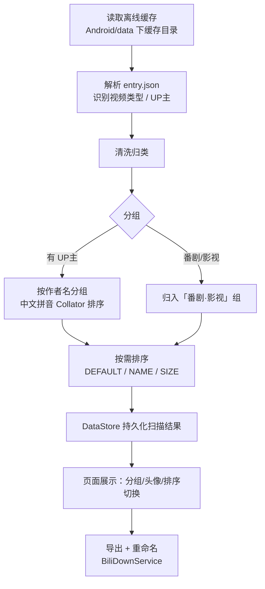
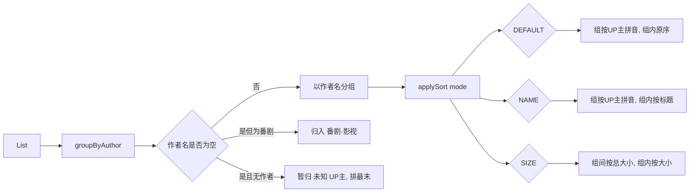
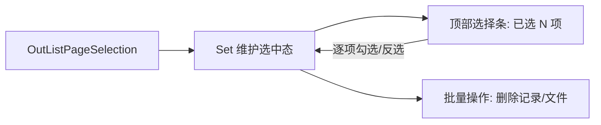
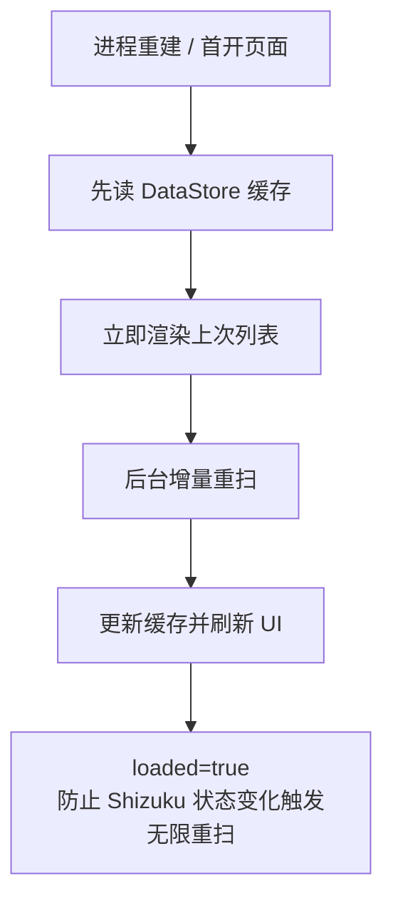
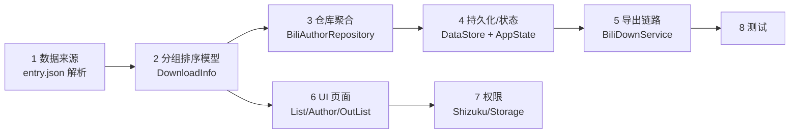

# 实现说明（给 AI / 开发者）

> 这份文档回答“**这些功能是怎么实现的**”，并使用对 AI / 开发者友好、可执行的方式描述。
> 如果你想基于这份代码**继续往下改**，请先读 [README](../README.md) 了解全局，再看本文的“阅读路线”和“改哪里”速查表。
> 动机与背景见 [MOTIVATION.md](MOTIVATION.md)。

---

## 1. 整体思路（为什么这样设计）

核心目标是把缓存列表从“一维平铺”升级为“**先分类、可排序、可批量操作**”的结构化视图，并对耗时操作做持久化兜底。

一句话：**清洗归类 → 分组建模 → 可组合排序 → 状态/加载统一管理 → 持久化兜底**。

---

## 2. 分组与排序（核心）

### 关键实现点

- **分组**：`entity/DownloadInfo.kt` 里的 `List<DownloadInfo>.groupByAuthor()`，返回 `DownloadGroup`（含 `author`、头像 `face`、视频列表 `videos`）。分组顺序用 `java.text.Collator`（`Locale.CHINA`）按作者名拼音排序，空作者名置尾。
- **番剧分类**：`const val BANGUMI_GROUP_LABEL = "番剧·影视"`，命中 `DownloadType.BANGUMI` 的内容全归入该组，不误进“未知 UP 主”。
- **排序**：`enum DownloadSortMode { DEFAULT, NAME, SIZE }` + `List<DownloadGroup>.applySort(mode)`。`SIZE` 时组间按“该组视频总大小”排、组内按单个文件大小排。

---

## 3. 多选（导出记录）

`ui/page/OutListPageSelection.kt` 用 `Set` 维护选中态，在 Compose 状态中驱动选择条与批量操作。

---

## 4. 稳定性 / 持久化兜底

`common/BiliAuthorRepository.kt` 把扫描结果写入 `DataStore`；`ui/page/AuthorPage.kt` 用 `loaded` 标志区分“已完成一次成功加载”与“空结果”，防止 Shizuku 状态变化触发无限重扫。

---

## 5. 给 AI / 开发者的阅读路线

建议按“数据从哪来 → 怎么加工 → 怎么展示”的顺序读：

1. **数据来源（缓存结构）**：`entity/BiliDownloadEntryInfo.kt`、`common/BiliEntryJsonParser.kt`
2. **领域模型 & 分组排序（核心）**：`entity/DownloadInfo.kt`（`DownloadSortMode` / `groupByAuthor()` / `applySort()`）
3. **数据聚合（仓库层）**：`common/BiliAuthorRepository.kt`
4. **持久化 & 全局状态**：`common/datastore/DataStoreKeys.kt`、`state/AppState.kt`
5. **导出链路**：`service/BiliDownService.kt`、`common/BiliDownFile.kt`、`common/BiliDownOutFile.kt`
6. **UI 层**：`ui/page/DownloadListPage.kt`（首页分组）→ `ui/page/AuthorPage.kt`（按 UP 主）→ `ui/page/OutListPage.kt` + `ui/page/OutListPageSelection.kt`（导出记录多选）
7. **权限**：`shizuku/permission/ShizukuPermission.kt`、`common/permission/StoragePermission.kt`
8. **测试（回归保障 / 行为文档）**：`app/src/test/` 下 `BiliEntryJsonParserTest`、`DownloadInfoTest`、`OutListPageSelectionTest` 等

---

## 6. “改哪里”速查表

如果你/你的 AI 想加一个具体能力，可以直接定位：

| 你想做的事 | 主要改的文件 |
| :-- | :-- |
| 改分组规则 / 新增分组维度 | `entity/DownloadInfo.kt`（`groupByAuthor`） |
| 新增一种排序方式 | `entity/DownloadInfo.kt`（`DownloadSortMode` / `applySort`） |
| 加新的筛选/过滤 | `ui/page/DownloadListPage.kt`（首页）或 `ui/page/AuthorPage.kt` |
| 改导出多选/批量的逻辑 | `ui/page/OutListPageSelection.kt`、`ui/page/OutListPage.kt` |
| 改导出文件命名/拼接 | `common/BiliDownFile.kt`、`common/BiliDownOutFile.kt`、`service/BiliDownService.kt` |
| 改缓存持久化策略 | `common/BiliAuthorRepository.kt`、`common/datastore/DataStoreKeys.kt` |
| 改 Shizuku / 存储权限交互 | `shizuku/permission/ShizukuPermission.kt`、`common/permission/StoragePermission.kt` |

> 每块核心逻辑都有对应单元测试，改完记得跑 `./gradlew testDebugUnitTest` 验证回归。

---

## 7. 给 AI 的一句话指引

> 当你拿到这个仓库，请**先读 [README](../README.md) 建立全局认知**，再依本文第 5 节“阅读路线”按序阅读代码，用第 6 节“速查表”定位要改的位置；改完用 `./gradlew testDebugUnitTest` 验证。本文与源码即为你的上下文，无需外部说明即可继续扩展。