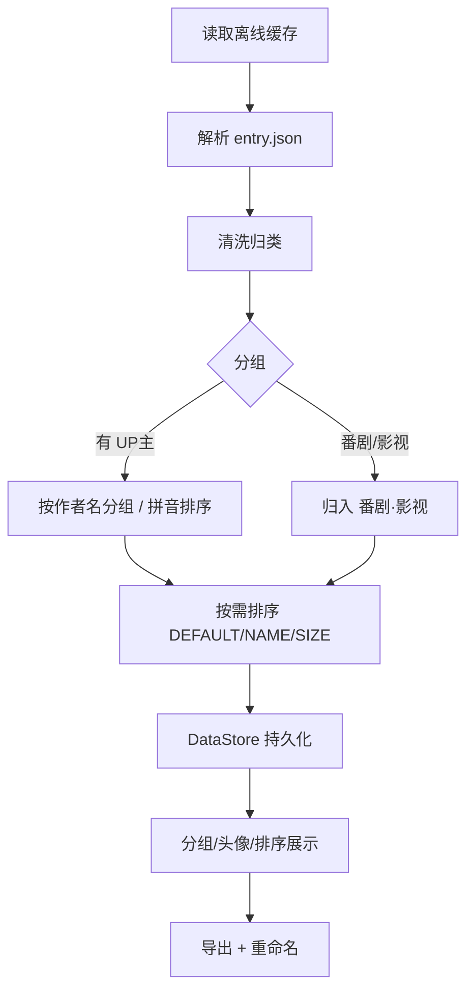

# 把「一维平铺的缓存列表」重构成「分组 · 排序 · 批量」：BiliDownOut 的实现与阅读路线

> 掘金 · 技术向 · 务实长文。由 `docs/promo/article-devs.md` 改稿并展开。

---

## 背景

哔哩哔哩 APP 的离线缓存存放在 `Android/data/tv.danmaku.bili/download/`，是一堆 `entry.json` + `blv/*.blv` 分片。上游 [10miaomiao/bili-down-out](https://github.com/10miaomiao/bili-down-out) 解决了「读取并合并导出」。但在我个人的使用场景里有三个不便：

1. **查找慢**：缓存多了之后，反复扫描 / 定位很耗时，重新打开又要等待。
2. **不能多选**：一次只能一个个处理。
3. **不能按 UP 主挑选**：列表一维平铺，番剧和 UP 主内容混在一起。

于是我在 fork 里做了相应增强，并达成稳定版 **v1.6.1**。

## 设计思路（一句话）

> **把列表从「一维平铺」升级为「先分类、可排序、可批量操作」的结构化视图，并对耗时操作做持久化兜底。**



## 核心实现

技术栈：Kotlin · Compose (Material3) · Room · DataStore · Shizuku · OkHttp · kotlinx.serialization。`minSdk 21 / targetSdk 35`。

### 1. 分组与排序（核心）

`entity/DownloadInfo.kt`：

```kotlin
val groups = downloadList.groupByAuthor()  // → List<DownloadGroup>
groups.applySort(DownloadSortMode.DEFAULT) // 或 NAME / SIZE
```

- `groupByAuthor()` 用 `java.text.Collator(Locale.CHINA)` 按作者名**拼音排序**，空作者名置尾。
- 番剧：`BANGUMI_GROUP_LABEL = "番剧·影视"`，命中 `DownloadType.BANGUMI` 的条目全部归入该组，**不误进「未知 UP 主」**。
- `applySort(SIZE)` 时，组间按该组视频总大小排、组内按单个文件大小排。

### 2. 多选（导出记录）

`ui/page/OutListPageSelection.kt` 用 `Set` 维护选中态，Compose 状态驱动顶部「已选 N 项」选择条与批量删除。

### 3. 稳定性 / 持久化兜底

`common/BiliAuthorRepository.kt` 把扫描结果写入 `DataStore`；`ui/page/AuthorPage.kt` 用 `loaded` 标志区分「已完成一次成功加载」与「空结果」，防止 Shizuku 状态变化触发无限重扫。

### 4. Shizuku 通道

`shizuku/permission/ShizukuPermission.kt` + `common/BiliDownFile.kt` 的 `RemoteServiceUtil`，让 Android 13+ 免 root 访问 `Android/data`。

## 给 AI / 开发者的阅读路线

按「数据从哪来 → 怎么加工 → 怎么展示」：

1. `entity/BiliDownloadEntryInfo.kt`、`common/BiliEntryJsonParser.kt` —— 数据来源
2. `entity/DownloadInfo.kt` —— 领域模型 & 分组排序（核心）
3. `common/BiliAuthorRepository.kt` —— 数据聚合
4. `common/datastore/DataStoreKeys.kt`、`state/AppState.kt` —— 持久化 / 状态
5. `service/BiliDownService.kt`、`common/BiliDownFile.kt`、`common/BiliDownOutFile.kt` —— 导出链路
6. `ui/page/DownloadListPage.kt` → `ui/page/AuthorPage.kt` → `ui/page/OutListPage.kt` —— UI
7. `shizuku/permission/ShizukuPermission.kt`、`common/permission/StoragePermission.kt` —— 权限

> 每块核心逻辑都有配套单元测试（`app/src/test/`），改完跑 `./gradlew testDebugUnitTest` 验证回归。

## 工程与发布

- **CI**：GitHub Actions，打 `v*` 标签自动跑单测 → 打 debug 包 → 发布 Release。
- **本地冒烟**：`export JAVA_HOME=<JDK17>` + `./gradlew assembleDebug`。

## 诚实声明

fork 自 `10miaomiao/bili-down-out`，保留上游版权声明（Apache-2.0）。并不是重造轮子，而是在成熟的导出链路上做「结构化视图 + 持久化兜底」。

## 链接

- **源码 / Star / Issues**：https://github.com/WhyWhatHow/bili-down-out
- **下载**：https://github.com/WhyWhatHow/bili-down-out/releases
- 深读：仓库 `docs/IMPLEMENTATION.md`、`docs/MOTIVATION.md`

欢迎技术讨论与贡献。