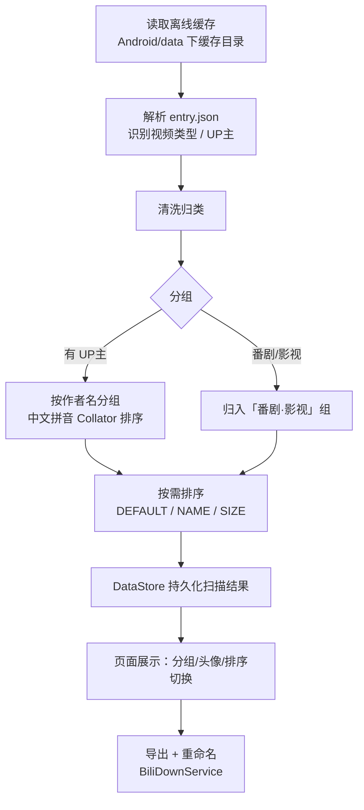
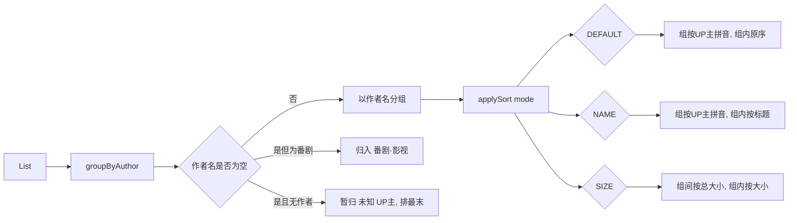
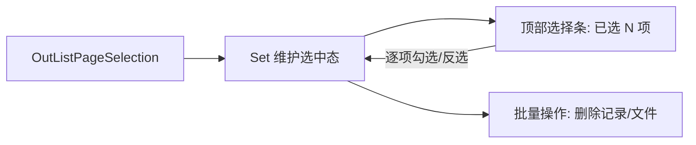
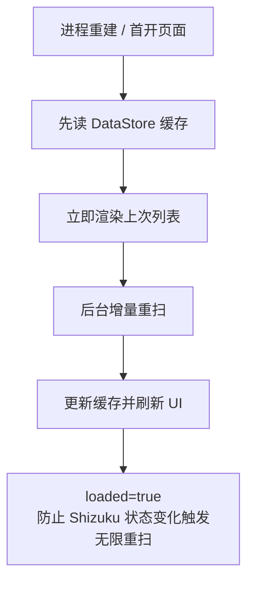
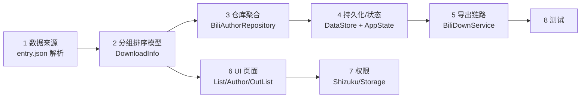

# 分享一个可定制的 BiliDownOut 增强版 fork（按 UP 主分组 + 多维排序 + 导出多选 + 稳定性修复）

> 项目：BiliDownOut（哔哩缓存导出）
> fork 仓库：https://github.com/WhyWhatHow/bili-down-out（当前版本 v1.6.1）
> 这段文字只是想诚实地介绍：我把上游项目拿过来做了一些增强并完整开源，**供有同类需求的人把代码交给自己的 AI / 开发者，当成起点去读、去改、去实现自己想要的定制**。写得不好或想得不对的地方，欢迎直接指正。

## 先说清楚来龙去脉

我自己一直是上游 [10miaomiao/bili-down-out](https://github.com/10miaomiao/bili-down-out) 的用户，真心感谢原作者的开源。用久了之后，只代表**我自己**遇到几个小痛点：

1. 缓存一多就全靠翻，找某位 UP 主的视频很费劲；
2. UP 主视频和番剧/影视混在一起，视觉混乱；
3. 进程被杀重建后，首次打开页面偶发一直转圈；
4. 导出记录缺少批量选择的便利。

于是我在上游 master 基础上做了一轮增强并开源。诚实说，**这套改动不一定是"标准答案"**，只是我循着"先想清楚再看代码"的顺序整理出的实现，希望能给同样有此需求的人一个上手的支点。

> 说明：这不是在推销某个二进制，而是分享一套**可复用、读得懂**的实现。仓库开源，打 `v*` 标签会自动构建并发布 debug 包。

---

## 一、新增了哪些功能

- **按 UP 主分组浏览**：缓存列表自动按 UP 主聚合，分组带 UP 主头像，按中文拼音排序。
- **番剧 / 影视独立分组**：没有 UP 主的番剧归入「番剧·影视」组，不再混进 UP 主内容。
- **多维排序**：默认（UP 主拼音）/ 按名称 / 按大小（组间也按该 UP 主总大小排序，便于找出最占空间的内容）。
- **导出记录多选**：导出记录页支持多选与批量处理。
- **稳定性修复**：列表扫描结果持久化缓存，尽量规避"进程被杀后首次打开一直转圈"。

## 二、做了哪些工作与修改

- **新增页面**：`ui/page/AuthorPage`（按 UP 主分组页）、`ui/page/OutListPageSelection`（多选页）。
- **新增数据层**：`common/BiliAuthorRepository`（UP 主信息 / 头像 / 列表扫描的数据聚合）。
- **核心重写**：`ui/page/DownloadListPage`（分组 + 排序 + 加载态 + Shizuku 授权引导）、`entity/DownloadInfo`（分组与排序模型）、`ui/page/OutListPage`（导出记录页）。
- **配套调整**：`service/BiliDownService`、`common/BiliDownFile` / `BiliDownOutFile`、`FileNameInputDialog`、`RecordItem` 等。
- **持久化**：`BiliAuthorRepository` 结合 `DataStore` 落盘列表缓存；`AppState` 增加全局扫表进度状态。
- **测试**：新增约 1100 行单元测试，覆盖 entry.json 解析、分组排序、多选、文件命名等。

---

## 三、整体修改逻辑 / 基本逻辑

核心是把列表从"一维平铺"升级为"**先分类、可排序、可批量操作**"的结构化视图（这只是我个人的一种取舍，欢迎大家有更好的思路）：

一句话概括五步：**清洗归类 → 分组建模 → 可组合排序 → 状态/加载统一管理 → 持久化兜底**。

1. **清洗归类**：解析每个离线缓存的 `entry.json`，识别视频类型（普通/番剧）与 UP 主。
2. **分组建模**：以 UP 主名称为 key 分组，番剧归入固定组；用中文 Collator 按拼音排序，未知 UP 主放最末。
3. **排序可组合**：分组结构固定，排序作用于"组内"与"组间"两个维度，不破坏分组语义。
4. **状态与加载**：用 Presenter 驱动 UI 状态，明确区分加载中 / 成功 / 空 / 失败 / Shizuku 未授权，尽量避免无限重扫。
5. **稳定性兜底**：扫描结果先落 DataStore，进程重建先读缓存再增量刷新，让首屏尽量即时可用。

---

## 四、功能的具体实现方式

### 4.1 分组与排序

- **分组**：`List<DownloadInfo>.groupByAuthor()` 返回 `DownloadGroup`（含 `author`、头像 `face`、`videos`）；顺序用 `java.text.Collator`（`Locale.CHINA`）按作者名拼音排序，空作者名置尾。
- **番剧分类**：`const val BANGUMI_GROUP_LABEL = "番剧·影视"`，命中 `DownloadType.BANGUMI` 的内容全归入该组，避免误进"未知 UP 主"。
- **排序**：`enum DownloadSortMode { DEFAULT, NAME, SIZE }` + `List<DownloadGroup>.applySort(mode)`；`SIZE` 下组间按"该组视频总大小"排、组内按单个文件大小排。

### 4.2 多选（导出记录）

- `OutListPageSelection` 用 `Set` 维护选中态，在 Compose 状态里驱动选择条与批量操作。

### 4.3 稳定性 / 持久化兜底

- `BiliAuthorRepository` 把列表扫描结果写入 `DataStore`；`AuthorPage` 用 `loaded` 标志区分"已完成一次成功加载"与"空结果"，防止 Shizuku 状态变化触发无限重扫。

---

## 五、给 AI / 开发者的阅读路线

如果你想把这份代码交给 AI 或自己研读，我**个人建议按这个顺序**看（因为它符合"数据从哪来 → 怎么加工 → 怎么展示"的思路，看的时候不容易晕）：

1. **数据从哪来（缓存结构）**：`entity/BiliDownloadEntryInfo.kt`、`common/BiliEntryJsonParser.kt`
2. **领域模型 & 分组排序（核心）**：`entity/DownloadInfo.kt`（`DownloadSortMode` / `groupByAuthor()` / `applySort()`）
3. **数据聚合（仓库层）**：`common/BiliAuthorRepository.kt`
4. **持久化 & 全局状态**：`common/datastore/DataStoreKeys.kt`、`state/AppState.kt`
5. **导出链路**：`service/BiliDownService.kt`、`common/BiliDownFile.kt`、`common/BiliDownOutFile.kt`
6. **UI 层（从首页到细分）**：`ui/page/DownloadListPage.kt`（首页分组）→ `ui/page/AuthorPage.kt`（按 UP 主）→ `ui/page/OutListPage.kt` + `ui/page/OutListPageSelection.kt`（导出记录多选）
7. **权限（Shizuku / 存储）**：`shizuku/permission/ShizukuPermission.kt`、`common/permission/StoragePermission.kt`
8. **测试（回归保障）**：`app/src/test/` 下的 `BiliEntryJsonParserTest` / `DownloadInfoTest` / `OutListPageSelectionTest` 等

> 顺序不是硬性的，你可以随时跳到任意一节——关键是先建立"数据 → 加工 → 展示"的整体图景，再深入细节。

---

## 六、测试

`app/src/test` 下都带 JUnit 单测：`BiliEntryJsonParserTest`（解析）、`DownloadInfoTest`（分组 / 番剧归类 / 三种排序，含中文拼音顺序）、`OutListPageSelectionTest`（多选状态机）、`BiliAuthorRepositoryTest`、`BiliDownOutFileTest`（命名）。这些测试也是了解"预期行为"的捷径。

---

## 七、你可以怎么用

- **想直接用**：下载 `v1.6.1` 的 APK 安装即可。
- **想自己定制**：直接 `git clone https://github.com/WhyWhatHow/bili-down-out.git`，让 AI 或你自己按上面的阅读路线去读，在你想要的方向上加功能（改排序、加过滤、改导出格式……）。这套实现**尝试**把"分组 / 排序 / 多选 / 持久化"拆成较清晰的模块，但一定还有不少不成熟之处，欢迎在你的定制中改掉。
- **想了解取舍**：文档里每节都对应可定位的源码位置，可以边看 issue 边翻代码。

如果这份实现对你或你的 AI 有帮助，仓库右上角的 **Star** 就是对我很大的认可。也欢迎基于你的定制做交流，但请记得保留对上游项目与作者的致谢——毕竟这只是站在巨人肩上的小小一步。